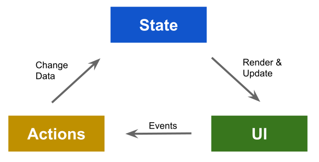

VanillaJS Component Architectures
===

## Reactive UI

UI presentation is a projection of data (state). Components "react" to changes in state and make changes in the UI accordingly.

Components also "react" to UI events by calling actions. Actions update state.

Notice this is a **one-way** flow:

    

## State and Component Hierarchies

"State" refers to things (data) that changes over time. Managing state and keeping the UI in sync is the hardest things about application development.

### Rules for Managing State

1. Each piece of state should have one, and only one, owner. This is also know as _single source of truth_
1. State should be owned by a component _as close as possible_ to where it is used
1. State shared across components _must be owned by a common ancestor_.

### Rules for Actions

1. The state should be changed by the owner
1. The owner passes callback functions to and thru child components
1. Callback functions perform actions (can involve calling an api) and ultimately update state
1. Owner updates children with new state 

### Planning

1. Visual Decomposition
    1. Create a mockup of the UI
    1. "Box" the UI into components
1. Component Hierarchy
    1. Turn the visual decomposition into a tree diagram
    1. Identify what state each component needs (if any)
    1. "Lift" state to common ancestor and pass down to child components
    1. Identify callback functions that need to be passed from state owners to components that have corresponding events

## VanillaJS Components

### Template(s)

Use functions and template literals to create blocks of html. You can use more than one, or none if component is very simple.

### Component Class

* `constructor`
    * Receive a `props` object with a property for each:
        * Needed state (data)
        * Callback function `on<ComponentEvent>` (present tense)
    * Store each prop on `this`
* `render` method
    * Called once for initial render
    * Uses template function
    * Child content
        * Creates child components
        * Calls their `render` methods
        * Append to place in DOM
        * (Don't use template literal!)
    * Needs to return `dom` of component
    * Store things you need later on `this`
* `update` method
    * Receives new data corresponding to data received in
    constructor
    * Conditionally checks for property changes and makes changes
    * Delegate to other methods if there are many possible updates

```js

let template = function(data) {
    return html`
        <li>
            <h2></h2>
            <p class="content"></p>
        </li>
    `;
}

class MyComponent {
    constructor(props) {
        // store initial data and callbacks
        this.name = props.name;
        this.description = props.description;
        this.onSelect = props.onSelect;
    }

    update(props) {
        // reference props
        let description = props.description;

        // Optionally test if update props 
        // contain individual prop updates
        // (be careful with object references!)

        // update DOM
        this.updateDescription(description);

        // if needed, track data 
    }

    // use common method for render and update
    updateDescription(description) {
        this.content.textContent = description;
    }

    render() {
        // render from template
        let dom = template(this.data1, this.data2);

        // Get reference to need elements.
        // If only used in render, use a variable:
        let li = dom.querySelector('li');
        let header = dom.querySelector('h2');
        // Store on `this` if needed in update
        this.content = dom.querySelector('p.content'); 

        // create and append child components
        let child = new ChildComponent({
            data: this.data1,
            onChildEvent: () => {
                // do action
            }
        });

        // set initial values
        header.textContent = this.name;
        // use common methods
        this.updateDescription(this.description);

        // subscribe to events
        li.addEventListener('click', () => {
            this.onSelect(this.name);
        });

        // return DOM to parent
        return dom;
    }
}

```